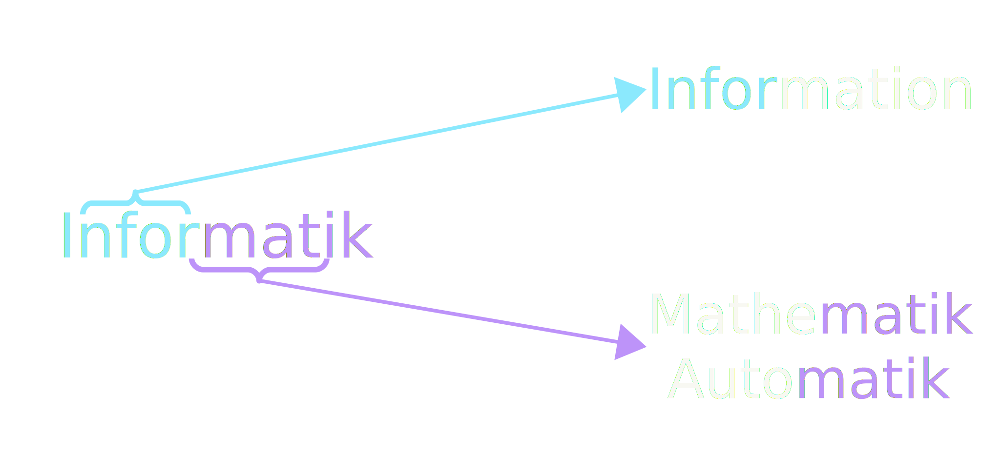
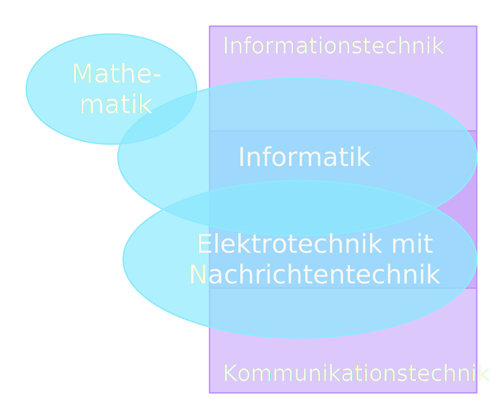
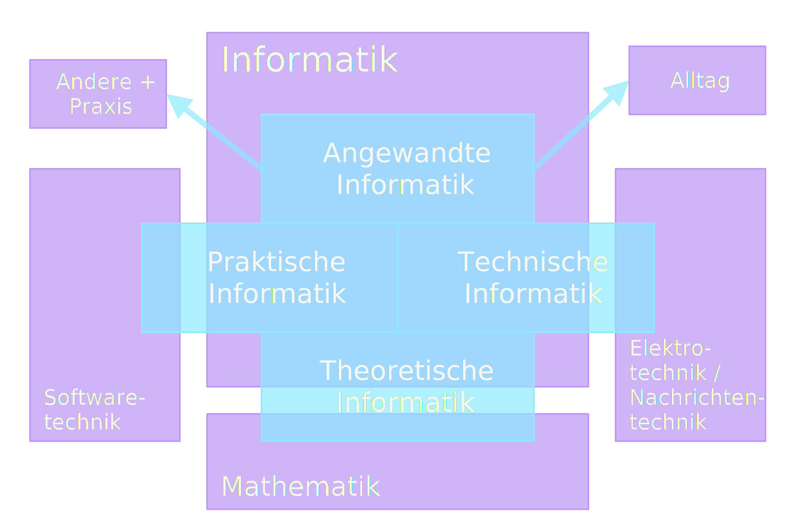

# Informatik - eine Einführung
## Drucker, Windows und Programmieren?
Am Anfang möchte ich mich ein wenig mit der Frage beschäftigen, was die Informatik eigentlich ist.

Einige würden sagen, es geht darum, wie man *Windows*, *Office*-Programme oder eine andere Software bedient.
Andere wiederum erwähnen dann so Dinge wie *Drucker* reparieren, *Computer* zusammenbauen oder *Programmieren*.
Aber das ist zu leicht gedacht, wenn nicht sogar völlig inkorrekt. 
Auch ist nicht überall Informatik drin, wo Informatik draufsteht: 
Informatik-Schulunterricht oder *Fachinformatiker*-Ausbildung (das meine ich überhaupt nicht böse oder entwertend!).

## Informatik = Computer?
Eine der häufigsten Antworten auf die Frage, was Informatik eigentlich ist, 
hört man, dass die was mit Computer zu tun haben. 
Das ist nicht ganz falsch, aber bei weitem auch nicht ganz richtig. 

### Ein Versuch einer Definition
Im Folgenden möchte ich ein paar verschiedene Definitionen aufzeigen, die allesamt ähnlich sind.

:::note Informatik

- Informatik beschäftigt sich mit der automatischen Informationsverarbeitung in Natur, Technik und Gesellschaft.
- Informatik ist die Wissenschaft der systematischen Verarbeitung von Informationen, besonders der automatischen Verarbeitung mithilfe von Computern.
- Wissenschaft von automatisierter Verarbeitung von (Daten und) Informationen

:::

In diesen Definitionen verstecken sich nun ein paar wichtige Worte, wie der Begriff der **Information**.
Eine Einführung dieses Begriffs erfolgt allerdings an anderer Stelle.
Auch wird das Wort "**automatisch**" in allen aufgeführt: Das ist der Teil mit den Computern.
Aber Informatik beschränkt sich nicht nur auf diese und ist vor allen Dingen mehr als Programmieren!

Ein bekannter Informatiker hat mal folgendes gesagt:
> In der Informatik geht es genauso wenig um Computer, wie in der Astronomie um Teleskope.
> 
> — Edsger Dijkstra

Computer sind ein Hilfsmittel, um das sich durchaus manche kümmern, aber keinesfalls die alleinige Beschäftigung!
Informatiker beschäftigen sich mit mehr als nur Computer.

Im Englischen wird Informatik gerne als *computer science* übersetzt, aber auch der Begriff *informatics* ist anzutreffen.
Das Wort Informatik kann man als Kofferwort betrachten und setzt sich aus zwei Wörtern zusammen. 
Jedoch gibt es zwei Alternativformen:

**Information** und **Automatik** deckt sich ja durchaus mit den Definitionen, aber was hat hier die **Mathematik** verloren?
Nun, das ist gerade der Punkt, auf den ich als angehender Mathematiker gerne rumreite und der Teil,
den viele unterschätzen oder gar nicht so genau davon wissen. 
Mathematik spielt im Ausbildungsberuf *Fachinformatiker* zum Beispiel kaum eine Rolle, 
weshalb ich diese weiter oben erwähnt habe.
Informatik als Wissenschaft **ist** Mathematik, alles baut darauf auf und aus meiner Sicht ist das gerade der
essenziellste Teil!

### Informatik = IT?
Außerdem hört man häufig, dass Menschen die **IT** mit **Informatik** gleichsetzen, auch das ist nicht ganz korrekt.
Die Informatik als Wissenschaft streift verschiedenste Themengebiete und andere Wissenschaften, die **Informationstechnik**
(IT) ist nur eine davon, wenngleich keine unwichtige!

:::caution Informationstechnik und Kommunikationstechnik

Die Informationstechnik steht für die Technik zur elektronischen Datenverarbeitung und die verwendete Hard- und Software-Infrastruktur.

Es handelt sich dabei also gar nicht um eine Wissenschaft, sondern ist ein Überbegriff für die Technik, die verwendet wird.
Die Informatik ist aber eine Wissenschaft die sich damit beschäftigt, die Technik zu erweitern.

Ein weiterer Begriff, ähnlich wie die IT, ist die Kommunikationstechnik.
Als Kommunikationstechnik bezeichnet man zusammenfassend Techniken für die technisch gestützte Kommunikation.

:::

Folgendes (chaotisches) Schaubild zeigt ein wenig das Zusammenspiel von den Wissenschaften (die Ovale) und den Technikbereichen (Rechtecke) zur Informatik.
Überschneidungen bedeuten hierbei, dass sich die Wissenschaften oder Techniken überschneiden in Bezug auf Untersuchungs- und Teilgebiete oder Technikbereiche.

## Teilgebiete der Informatik
Im Folgenden möchte ich die Informatik und ihre Teilgebiete und dessen Bezug zu anderen Wissenschaften oder Techniken etwas genauer vorstellen.
Bisher habe ich noch keine konkreten Namen genannt, womit sich die Informatik denn genau beschäftigt.
Folgendes Schaubild liefert einen ersten Überblick:

Einige der unten aufgezählten Untersuchungsgebiete lassen sich auch anderen Teilgebieten zuordnen,
da diese natürlich untereinander enge Verbindungen haben und es sich nicht immer klar abgrenzen lässt.

### Theoretische Informatik
Die theoretische Informatik entstand aus der Mathematik und bildet die theoretische Grundlage aller anderen Teilgebiete.

:::note Theoretische Informatik

Die theoretische Informatik beschäftigt sich mit der Abstraktion, Modellbildung und grundlegenden Fragestellungen, 
die mit der Struktur, Verarbeitung, Übertragung und Wiedergabe von Informationen in Zusammenhang stehen.[^1]

:::

Sie umfasst unter anderem folgende Untersuchungsgebiete:
- Logik (auch in Mathematik und Philosophie)
- Informationstheorie (auch in Nachrichtentechnik und Stochastik)
- Formale Sprachen (z.B. Programmiersprachen)
- Automatentheorie
- Entscheidbarkeit
- Berechenbarkeit (Welche Probleme sind berechenbar?)
- Komplexität (Rechen- und Speicheraufwand)
- Graphentheorie

### Technische Informatik
Die technische Informatik steht eng mit der Elektrotechnik und Nachrichtentechnik in Verbindung und hat tatsächlich etwas mit Computer zu tun.

:::note Technische Informatik

Die technische Informatik beschäftigt sich mit den hardwaretechnischen Grundlagen von Rechen- und Kommunikationssystemen.[^1]

:::

Sie umfasst unter anderem folgende Untersuchungsgebiete:
- Digitaltechnik (Logikgatter)
- Schaltnetze und Schaltwerke
- Prozessoren
- Speicher
- Signalverarbeitung
- Rechnerarchitektur
- Rechnernetzwerke 
- Computerperipherie 
- Hardwareentwurf
- Eingebettete Systeme

### Praktische Informatik
Die praktische Informatik beschäftigt sich zum einen mit Programmiersprachen selbst und ihren Eigenschaften, 
aber auch mit der Softwaretechnik (u.a. Design, Entwurf, Test und Projektmanagement).

:::note Praktische Informatik

Die praktische Informatik beschäftigt sich mit Algorithmen, Datenstrukturen, 
Programmiersprachen, Betriebssystemen und Datenbanken sowie mit den softwareseitigen Grundlagen der Informatik.[^1]

:::

Sie umfasst unter anderem folgende Untersuchungsgebiete:
- Programmierung und Programmiersprachen
- Compilerbau
- Algorithmen und Datenstrukturen (eng mit theoretischer Informatik)
- Betriebssysteme (eng mit technischer Informatik)
- Softwareentwicklung

### Angewandte Informatik
Die angewandte Informatik verwendet nun viele Erkenntnisse aus den obigen Teilen und 
wendet diese in anderen Bereichen und im Alltag an.

:::note Angewandte Informatik

Die Angewandte Informatik wendet Kenntnisse aus der Informatik an, um Rechenanlagen, 
Software und Verfahren für andere Wissenschaften oder Anwendungsgebiete herzustellen.[^1]

:::

Sie umfasst unter anderem folgende Untersuchungsgebiete:
- Künstliche Intelligenz
- Computergrafik
- Kryptologie (eng mit Mathematik und theoretischer Informatik)
- Multimedia
- Simulation
- Assistenzsysteme
- "*Bindestrich*"-Informatik
  - Wirtschaftsinformatik
  - Medizinische Informatik
  - Medieninformatik
  - Bioinformatik
  - etc.

[^1]: https://de.wikipedia.org/wiki/Portal:Informatik