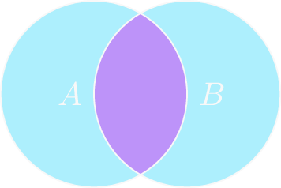
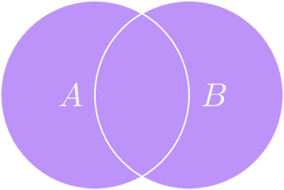
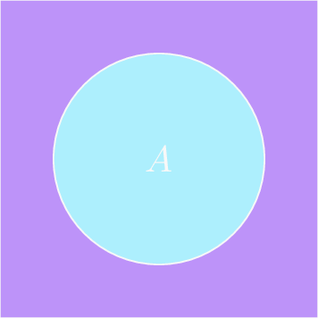
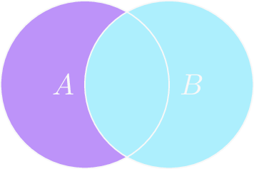

# Mengenbildung und Mengenalgebra
Bereits in der [Einführung zur Mengenlehre](mengenlehre.md#Über-die-mengenlehre) wurde angemerkt, 
dass die heute verwendete Mengenlehre nicht mehr die naive Mengenlehre nach Cantor ist,
sondern eine axiomatisierte Mengenlehre, die man *Zermelo-Fraenkel-Mengenlehre* (kurz *ZF* oder auch *ZFC*)[^1] nennt, ist.
Diese Mengenlehre "enthält" die naive Mengenlehre und merzt die gezeigten Widersprüche aus.
Diese Axiomatisierung wird hier allerdings nicht direkt vorgestellt oder explizit genannt.
Stattdessen werden manche Axiome beiläufig eingeführt.
Es können auch Axiome vorkommen, die in anderen Axiomatisierungen der Mengenlehre auftreten.

## Mengenbildung
*Bertrand Russell* entwickelte die *Typentheorie*, nach der man die Mengenlehre auch stufenweise aufbauen kann.
Hierbei gibt es eine kleinste Stufe, deren Elemente man *Urelemente* oder *Urmengen* nennt.

```admonish note title="Stufenaufbau nach Russell"
$$
    \begin{array}{c|c||c}
        \text{formale Benennung} & \text{häufige Benennung} & \\
        \hline\hline
        X^0, Y^0, \dots & a, b, c, \dots & \text{Mengen 0. Stufe (Urelemente)}\\
        X^1, Y^1, \dots & A, B, C, \dots & \text{Mengen 1. Stufe}\\
        X^2, Y^2, \dots & \mathfrak{A}, \mathfrak{B}, \mathfrak{C}, \dots & \text{Mengen 2. Stufe}\\
        \vdots & & \vdots\\
        M^n & & \text{Menge n-ter Stufe}
    \end{array}
$$
```

#### Beispiele
Dabei sind die Elemente der jeweiligen Stufe stets Elemente der vorigen Stufe.

Eine Menge von Urelementen ist also eine Menge erster Stufe: $M^1 = \{ X^0, Y^0 \} = \{ a, b \} = A$.

Eine Menge zweiter Stufe ist also eine *Menge von Mengen*: $M^2 = \{ X^1, Y^1 \} = \{\{ a, b, c \}, \{ x, y \}\} = \{ A, B \} = \mathfrak{A}$.
*Mengen von Mengen* oder ein *System von Mengen* nennt man auch häufig ein *Mengensystem*.
Mengensysteme spielen u.a. in der Maßtheorie eine wichtige Rolle, in der auch das Benennungsschema wiederzuerkennen ist.

Folgendes Axiom bildet eine Brücke zur Logik:

```admonish note title="Mengenbildungsaxiom"
Sei $H(M^n)$ Aussage über Mengen $n$-ter Stufe.
$$
    \begin{equation*}
        \exists M^{n+1}\ \forall M^n:\ M^n \in M^{n+1} \leftrightarrow H(M^n),
    \end{equation*}
$$
wobei $M^{n+1}$ nicht in $H(M^n)$ vorkommt.
```

Das Mengenbildungsaxiom sagt aus, dass es eine Menge $M^{n+1}$ gibt, die aus den Elementen $M^n$ besteht, die eine gewisse Aussage erfüllen. 

#### Beispiele
Sei $n = 0$, dann können wir die Aussage im Satz mit den üblichen Benennungen wie folgt schreiben:
$$
    \begin{equation*}
        \exists A\ \forall x:\ x \in M \leftrightarrow H(x).
    \end{equation*}
$$
"$M^{n+1}$ kommt nicht in $H(M^n)$ vor" bedeutet, dass in $H(M^n)$ nirgends das Symbol $M^{n+1}$ auftauchen darf.
Deswegen ist $\exists A\ \forall x:\ x \in M \leftrightarrow x \notin M$, also ein Widerspruch, ausgeschlossen.
Denn in $H(x) = \text{"}x \notin M\text{"}$ taucht ja $M$ auf und das ist nicht erlaubt

Sei $n = 0$ und $H(x) = \text{"} x \text{ ist eine gerade natürliche Zahl"}$.
Alle Elemente $x$, die nun $H$ erfüllen liegen in einer Menge $A$:
$A = \{2, 4, 6, \dots\}$

So eine Aussagenform $H(x)$ nennt man auch *definierenden Ausdruck*. 
Man schreibt Mengen mit definierenden Ausdrücken häufig so:
$M = \{ x\ |\ H(x) \}$.

#### Beispiele
Das obige Beispiel mit den geraden natürlichen Zahlen schreibt man also so:
$M = \{ x\ |\ x \in \mathbb{N} \wedge x \text{ gerade} \}$

Weitere Beispiele sind:
- Menge aller deutschen Bundesländer: $M = \{ x\ |\ x \text{ ist deutsches Bundesland} \}$
- Menge aller reellen Zahlen von 0 bis 2: $M = \{ x\ |\ x \in \mathbb{R} \wedge 0 \le x \le 2 \}$
- Menge der ganzzahligen Lösungen einer Gleichung: $M = \{ x\ |\ x \in \mathbb{Z} \wedge x^2 + 2 = 4x - 1 \}$
- Menge aller ganzen Quadratzahlen: $M = \{ x\ |\ \exists y \in \mathbb{Z}:\ x = y^2 \}$

```admonish note title="Extensionalitätsaxiom (ZF) / Gleichheit von Mengen"
Zwei Mengen sind gleich, wenn sie die gleichen Elemente besitzen:
$$
    \begin{equation*}
        A = B\ :=\ \forall x:\ x \in A \leftrightarrow x \in B 
    \end{equation*}
$$
```

## Mengenalgebra
Auf Mengen kann verschiedene Operationen durchführen.
Man stelle sich vor, man möchte zwei Mengen zusammenfassen zu einer oder man möchte eine Menge erzeugen, 
die nur die Elemente enthält, die zwei Mengen gemeinsam haben.
Diese Mengenoperationen werden im Folgenden vorgestellt.

### Mengenoperationen
Charakteristisch für Mengenoperationen ist, dass sie direkt auf den logischen Operatoren basieren und das auch in ihren
Operationssymbolen wiederspiegeln.
Zwischen den Mengen- und den Logikoperatoren besteht also eine enge Verbindung, 
weshalb man die Mengenlehre als Teilgebiet der *mathematischen Logik* zählen kann.

Zu jeder Operation ist ein Bild.
Dieses Bild veranschaulicht die Auswirkung der Operation.
Mengen werden dabei als Ovale bzw. Kreise dargestellt.
Diese Ovale können überlappen, um zu zeigen, dass sie Elemente gemeinsam haben.
Der in lila eingefärbte Bereich ist dann die neue Menge, die entsteht, wenn man eine Mengenoperation auf den vorhanden Mengen ausführt.
Eine solche Darstellung nennt man *Venn-Diagramm*[^2].

#### Durchschnitt
Die Menge die entsteht, wenn man nur die Elemente aus zwei gegebenen Mengen nimmt, die sie gemeinsam haben nennt, man *Durchschnitt*
oder *Schnittmenge*.

```admonish note title="Durchschnitt"
$$
    A \cap B := \{ x\ |\ x \in A \wedge x \in B \}
$$

gesprochen: "A geschnitten B"
```

Zugehöriges Venn-Diagramm:



##### Beispiele
Gegeben seien $A = \{ a, b, c \}$ und $B = \{ b, c, d \}$.
Dann ist $A \cap B = \{ b, c \}$.

Gegeben seien  $A = \{ a, b, c \}$ und $B = \{ e, f, g \}$.
Dann ist $A \cap B = \{ \} = \emptyset$ leer. 
Das Symbol $\emptyset$ steht dabei in der Mathematik für die *leere Menge*, also eine Menge, die keine Elemente enthält.

Gegeben seien $A = \{ a, b, c \}$ und $B = \{ a, b, c \}$.
Dann ist $A \cap B = \{ a, b, c \} = A = B$.
Die beiden Mengen $A$ und $B$ sind gleich - entsprechend auch deren Durchschnitt.

Gegeben seien $A = \{ x\ |\ x \in \mathbb{N} \wedge x \text{ ist gerade} \}$ und $B = \{ 2, 8, 1001, 4088, 9999 \}$.
Dann ist $A \cap B = \{2, 8, 4088 \}$.

#### Vereinigung
Die Menge die entsteht, wenn man die Elemente aus zwei gegebenen Mengen nimmt, und sie in einer Menge *vereinigt*
nennt man *Vereinigung* oder *Vereinigungsmenge*.
Elemente, die in beiden vorkommen, werden dabei nur einmal gezählt.

```admonish note title="Vereinigung"
$$
    A \cup B := \{ x\ |\ x \in A \vee x \in B \}
$$

gesprochen: "A vereinigt B"
```

Zugehöriges Venn-Diagramm:



##### Beispiele
Gegeben seien $A = \{ a, b, c \}$ und $B = \{ b, c, d \}$.
Dann ist $A \cup B = \{ a, b, c, d \}$.

Gegeben seien  $A = \{ a, b, c \}$ und $B = \{ e, f, g \}$.
Dann ist $A \cup B = \{ a, b, c, e, f, g\}$.

Gegeben seien $A = \{ a, b, c \}$ und $B = \{ a, b, c \}$.
Dann ist $A \cup B = \{ a, b, c \} = A = B$.
Die beiden Mengen $A$ und $B$ sind gleich - entsprechend auch deren Vereinigung.

#### Komplement
Das *Komplement* einer Menge besteht gerade aus den Elementen, die nicht in der Menge $A$ liegen, also alles andere außer die Menge $A$.

```admonish note title="Komplement"
$$
    \overline{A} = A^\complement := \{ x\ |\ \neg (x \in A) \} = \{ x\ |\ x \notin A \}
$$

gesprochen: "Komplement von A"
```

Zugehöriges Venn-Diagramm:



##### Beispiele
Gegeben seien $M = \{ a, b, c, d, e \}$ und $A = \{ b, c, d \}$.
Dann ist $\overline{A} = \{ a, e \}$.
Hier ist es wichtig, dass wir $A$ in einen Bezug zu einer anderen "Übermenge" $M$ setzen.
So eine Menge nennt man *Universum* oder *Grundmenge*.
Die Menge $A$ ist ein Teil des Universums $M$.

Gegeben sei das Universum $A = \{ b, c, d \}$.
Dann ist $\overline{A} = \emptyset$.

#### Differenz
Wenn man zwei Mengen hat und man möchte eine Menge bilden, die nur die Elemente enthält, die in einer Menge vorkommen, 
aber ohne die Elemente, die auch in der anderen liegen, dann ist das die *Differenzmenge* oder *Mengendifferenz*.

```admonish note title="Differenz"
$$
    A \setminus B := \{ x\ |\ x \in A \wedge x \notin B \}

$$

gesprochen: "A ohne B"
```

Zugehöriges Venn-Diagramm:



Für die Differenz und das Komplement gilt eine besondere Beziehung:
Sei $M$ das Universum und $A$ Teil des Universums, dann gilt: $M \setminus A = \overline{A}$.

##### Beispiele
Gegeben seien $A = \{ a, b, c, d \}$ und $B = \{ b, c, d, e \}$.
Dann ist $A \setminus B = \{ a \}$.

Gegeben seien $A = \{ a, b, c, d \}$ und $B = \{ d, e \}$.
Dann ist $A \setminus B = \{ a, b, c \}$.

Gegeben seien $M = \{ a, b, c, d \}$ und $A = \{ b, c \}$.
Dann ist $M \setminus A = \{ a, d \} = \overline{A}$.

Die Mengenoperationen wurden anhand Mengen 1. Stufe eingeführt, wie es die Symbolik erahnen lassen.
Jedoch gelten diese auch für Mengen höherer Stufen.

### Rechenregeln für Mengenoperationen
Für die Mengenoperationen gibt es gewisse Rechenregeln, die hier nun vorgestellt werden sollen.

```admonish example title="Rechenregeln für Mengenoperationen"
1. $$
   \begin{align*}
       \begin{aligned}
           (A \cap B) \cap C &= A \cap (B \cap C)\\
           (A \cup B) \cup C &= A \cup (B \cup C)
       \end{aligned}
       &&\text{Assoziativität}
   \end{align*}
$$
2. $$
   \begin{align*}
      \begin{aligned}
         A \cap B = B \cap A\\
         A \cup B = B \cup A
      \end{aligned}
      &&\text{Kommutativität}
   \end{align*}
$$
3. $$
   \begin{align*}
      \begin{aligned}
         A \cap (A \cup B) = A\\
         A \cup (A \cap B) = A
      \end{aligned}
      &&\text{Absorption}
   \end{align*}
$$
4. $$
   \begin{align*}
      \begin{aligned}
         A \cup (B \cap C &= (A \cup B) \cap (A \cup C)\\
         A \cap (B \cup C &= (A \cap B) \cup (A \cap C)
      \end{aligned}
      &&\text{Distributivität}
   \end{align*}
$$
5. $$
   \begin{align*}
      \begin{aligned}
         A \cap \overline{A} &= \emptyset\\
         A \cup \overline{A} &= U\quad \text{($U$ Universum)}
      \end{aligned}
      &&\text{Komplementgesetze}
   \end{align*}
$$
```

Auch wenn einem manches davon vielleicht schon bekannt ist oder es als offensichtlich erscheint,
so ist es keineswegs sicher, dass es im Allgemeinen gilt.
In der Mathematik muss man auch solche Kleinigkeiten beweisen.
Also folgt an dieser Stelle ein erster Beweis für die Assoziativität des Durchschnitts:

#### Beweis
Zu zeigen ist: $(A \cap B) \cap C = A \cap (B \cap C)$
$$
\begin{alignat*}{2}
    \quad && &(A \cap B) \cap C\\
    \overset{\text{Def. } \cap}{=}\quad && &\{ x\ |\ x \in A \cap B \wedge x \in C \}\\
    \overset{\text{Def. } \cap}{=}\quad && &\{ x\ |\ (x \in A \wedge x \in B) \wedge x \in C \}\\
    \overset{\text{Ass. } \wedge}{=}\quad && &\{ x\ |\ x \in A \wedge (x \in B \wedge x \in C) \}\\
    \overset{\text{Def. } \cap}{=}\quad && &\{ x\ |\ x \in A \wedge x \in B \cap C \}\\
    \overset{\text{Def. } \cap}{=}\quad && &A \cap (B \cap C) \qquad\qquad\qquad\qquad\blacksquare
\end{alignat*}
$$
Im Beweis stützen wir uns auf unsere Definition der Durchschnitts mittels der direkten Mengenschreibweise und des definierenden Ausdrucks.
Der definierende Ausdruck ist eine Aussagenform und kann daher mittels den Rechenregeln der logischen Operatoren manipuliert werden.
In diesem Fall haben wir die Assoziativität der Konjunktion ("und", $\wedge$) ausgenutzt.
Das $\blacksquare$ markiert schließlich das Ende des Beweises.

Nach ähnlichem Schema können nun auch die anderen Regeln bewiesen werden.

### Teilmenge
In den Beispielen beim [Komplement](#beispiele-5) tauchte folgender Satz auf:
> Die Menge $A$ ist ein Teil des Universums $M$.

Dieses Wort "Teil" lässt sich wie folgt definieren:

```admonish note title="Inklusion"
Seien $M, A$ Mengen.
- $A \subseteq M := \forall x:\ x \in A \rightarrow x \in M$
- $A \subset M := A \subseteq M \wedge A \ne M$

Für $A \subseteq M$ spricht man "$A$ ist *Teilmenge* von $M$" und
für $A \subset M$ spricht man "$A$ ist *echte Teilmenge* von $M$"
```

Eine Teilmenge $A$ ist also mit ihren Elementen ganz und gar in ihrer *Obermenge* $M$ enthalten.
Man bezeichnet diese Teilmengenbeziehung auch als *Inklusion*.

#### Beispiele
Gegeben seien $M = \{ a, b, c, d \}$ und $A = \{ a, b \}$.
Dann gilt $A \subseteq M$. 
Es gilt sogar $A \subset M$.

Gegeben seien $M = \{ a, b, c, d \}$ und $A = \{ a, b, c, d \}$.
Dann gilt $A \subseteq M$, aber nicht $A \subset M$.

Gegeben seien $M = \{ a, b, c, d \}$ und $A = \{ e, f, g \}$.
Dann gilt $A \not\subseteq M$.

### Verband
In der Mathematik untersucht man viele Strukturen.
Strukturen sind dabei meist eine Menge mit zusätzlichen Dingen, wie Operationen.
Die formale Definition einer ($n$-stelligen) Operation erfolgt später.
Hier sei nur gesagt, dass $\cap$ und $\cup$ *zweistellige Operationen* sind.

```admonish note title="Verband"
Seien $\mathfrak{M}$ Menge und $\cap, \cup$ zweistellige Operationen in $\mathfrak{M}$.

Ein Tripel $(\mathfrak{M}, \cap, \cup)$ heißt
- *Verband*, falls Assoziativität, Kommutativität und Absorption für alle $A, B, C \in \mathfrak{M}$ gelten.
- *distributiver Verband*, falls Verband und zusätzlich Distributivität für alle $A, B, C \in \mathfrak{M}$ gelten.
- *Boolesche Algebra*[^3], falls distributiver Verband und zusätzlich Komplementgesetze für alle $A, B, C \in \mathfrak{M}$ gelten.
  (auch *komplementärer, distributiver Verband*)
```

Die Mengenoperationen bilden eine boolesche Algebra, aber auch die logischen Ausdrücke in der Aussagenlogik können als eine aufgefasst werden.
$\cap$ und $\cup$ stehen dort dann für $\wedge$ und $\vee$.

Hier findet eine Abstraktion statt:
Statt sich nur auf die oben eingeführten Mengenoperationen zu beschränken, wird in der Definition nur verlangt, 
dass die genannten Rechenregeln gelten.
Wie diese Operation aussieht, ist egal.
Es kann also auch eine völlig andere Operation gewählt werden, solange sie die Rechenregeln erfüllt ist es ein Verband.
$\cap$ und $\cup$ stehen also lediglich für ein Symbol, das gegen ein anderes Symbol und entsprechender Bedeutung ausgetauscht werden kann.

### Potenzmenge
Eine wichtige Menge (mindestens) zweiter Stufe ist die *Potenzmenge*.
Die *Menge aller Teilmengen*.

```admonish note title="Potenzmenge"
Sei $M$ Menge, dann heißt $2^M = \mathcal{P}(M) = \{ A\ |\ A \subseteq M \}$ *Potenzmenge* von $M$.
```

Die Bezeichnung $2^M$ kommt daher, da die Anzahl der Elemente in der Potenzmenge "2 hoch der Anzahl der Elemente in M" entspricht.
Wenn also $M$ drei Elemente enthält, dann hat $\mathcal{P}(M)$ $2^3 = 8$ Elemente.
Die Anzahl der Elemente einer Menge wird im Abschnitt [Endlichkeit und Kardinalzahlen](5_endlichkeit.md) weiter thematisiert.

#### Beispiele
Gegeben sei $M = \{ a, b, c \}$.
Dann ist $\mathcal{P}(M) = \{ \emptyset, \{a\}, \{b\}, \{c\}, \{a, b\}, \{a, c\}, \{b, c\}, M \}$ Potenzmenge von $M$.
Man beachte, dass insbesondere auch die leere Menge $\emptyset$ und die Menge $M$ selbst Teilmengen von $M$ sind.

Gegeben sei $M = \{ \{a\}, \{b\} \}$.
Dann ist $\mathcal{P}(M) = \{ \emptyset, \{\{a\}\}, \{\{b\}\}, M \}$ Potenzmenge von $M$.

Gegeben sei $M = \{ \{a\} \}$.
Dann ist $\mathcal{P}(M) = \{ \emptyset, M \}$ Potenzmenge von $M$. 
Wenn man die Potenzmengenbildung weiter betreibt, 
dann ist $\mathcal{P}(\mathcal{P}(M)) = \{ \emptyset, \{\emptyset\}, M, \mathcal{P}(M) \}$ Potenzmenge von $\mathcal{P}(M)$.
Man mache sich klar, dass $\emptyset \ne \{\emptyset\}$ ist.

Die Potenzmenge mit den üblichen Mengenoperationen $\cap$ und $\cup$ ist eine boolesche Algebra.

---
[^1]: Benannt nach *Ernst **Z**ermelo* und *Abraham **F**raenkel*.
    Das *C* steht für *choice* und steht für das *Auswahlaxiom*.
    Je nachdem, ob man das Auswahlaxiom mit zu den Axiomen hinzunimmt kürzt man mit *ZF* oder eben *ZFC* ab.

[^2]: Benannt nach *John **Venn***.

[^3]: Benannt nach *George **Boole***. 
    Einer der Begründer der mathematischen Logik