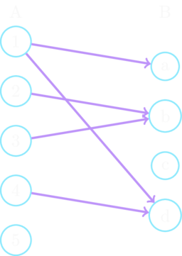
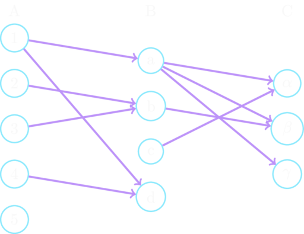

# Kartesisches Produkt und Relationen
In Mengen werden Objekte zusammengefasst, allerdings ohne innere Struktur,
d.h. sie sind einfach in der Menge ohne Bedeutung und ohne Reihenfolge.
Manchmal benötigt man jedoch so etwas wie eine Reihenfolge oder 
möchte Mengen miteinander in eine gewisse Verbindung bringen, ohne sie einfach nur zu Vereinigen.

## Kartesisches Produkt
:::note Geordnete Paare

Ein *geordnetes Paar* (*2-Tupel*) mit den Elementen $a$ und $b$ ist wie folgt als Menge definiert:
$$
    (a, b)\ :=\ \{ \overbrace{\{a, b\}}^{\text{Elemente des Tupels}}, \underbrace{\{a\}}_{\text{Erstes Element}} \}
$$ 

:::
Ein 2-Tupel fasst also je zwei Elemente zusammen und bestimmt dabei, welches zuerst kommt.
Anders als bei Mengen, bei denen $\{a,b\} = \{b,a\}$ gilt, gilt bei 2-Tupeln demnach $(a,b) \ne (b,a)$.
Die andere Schreibweise $()$, statt $\{\}$, soll dies verdeutlichen und dazu führen, dass man diese nicht verwechselt.

Ein Verband haben wir als ein *Tripel* eingeführt.
Ein Tripel ist ein 3-Tupel.
Allgemein lassen sich rekursiv n-Tupel wie folgt definieren:

:::note n-Tupel

- 1-Tupel: $(x_1) = \{ x_1 \}$
- 2-Tupel: $(x_1, x_2) = \{ \{x_1, x_2\}, \{x_1\} \}$
- 3-Tupel: $(x_1, x_2, x_3) = ((x_1, x_2), x_3)$
- n-Tupel: $(x_1, x_2, \dots, x_n) = ((x_1, x_2, \dots, x_{n-1}), x_n)$

:::
n-Tupel lassen sich also auf die Mengendarstellungen der 2-Tupel zurückführen.
In der Typentheorie nach Russell, die im Kapitel über [Mengen](../2_mengen.md) eingeführt wurde ist dies allerdings nicht erlaubt.
Denn schon bei einem 3-Tupel gibt es eine Vermischung verschiedener Mengenstufen:
$$
    \begin{align*}
        (a, b, c)   &= ((a, b), c)\\
                    &= \{\ \{(a,b), c\},\ \{(a,b)\}\ \}\\
                    &= \{\ \{\ \underbrace{\{\{a,b\}, \{a\}\}}_{(a,b)},\ c\},\ \{\underbrace{\{\{a,b\}, \{a\}\}}_{(a,b)}\}\ \}\\
                    &= \{\ \{\ \underbrace{\{\{a,b\}, \{a\}\}}_{\text{Menge 2. Stufe}},\ \underbrace{c}_{\text{Menge 0. Stufe}}\},\ \{\{\{a,b\}, \{a\}\}\}\ \}
    \end{align*}
$$
Im Stufensystem ist dieser Ausdruck also nicht korrekt.
In anderen axiomatisierten Mengenlehren ist es allerdings erlaubt.
Auch für das Stufensystem gibt es korrekte Definitionen für n-Tupel.
Wir wollen es an dieser Stelle allerdings dabei belassen und nehmen es einfach hin.

Man kann nun Tupel zu einer Menge zusammenfassen.
Die Menge aller Tupel von Mengen nennt man *kartesisches Produkt*:

:::note Kartesisches Produkt

Seien $A$ und $B$ Mengen, dann ist das *kartesische Produkt* der Mengen $A$ und $B$ definiert als
$$
    A \times B\ :=\ \{ (a,b)\ |\ a \in A \wedge b \in B \}
$$

Mit 
- $A^0 := \{ \emptyset \}$
- $A^1 := A$
- $A^{n+1} := A^n \times A$ 

erhalten wir die *n-fache kartesische Potenz*.

:::

## Relationen
Das kartesische Produkt erlaubt es uns jetzt Paare in einer Menge zusammenzufassen.
Daraus können wir nun eine Teilmenge betrachten.

:::note Relation

Seien $A$, $B$ Mengen.
Man nennt $R$ *Relation* oder *Korrespondenz* __aus__ $A$ __in__ $B$ $:=\ R \subseteq A \times B$

:::

#### Beispiele
Nehmen wir eine Menge mit drei Elementen $A = \{a_1, a_2, a_3\}$ und bilden alle möglichen Paare.
Diese Paare fassen wir nun in einer Menge zusammen: 
$$
    A \times A = \{(a_1, a_1), (a_1, a_2), (a_1, a_3),\quad (a_2, a_1), (a_2, a_2), (a_2, a_3),\quad (a_3, a_1), (a_3, a_2), (a_3, a_3)\}
$$
Daraus können wir jetzt bspw. unterschiedliche Relationen basteln:
$$
    \begin{align*}
        R_0 &= \emptyset\\
        R_1 &= \{(a_1, a_1), (a_1, a_3)\}\\
        R_2 &= \{(a_1, a_1), (a_1, a_3), (a_2, a_2), (a_2, a_3), (a_3, a_3)\}\\
        R_3 &= \{(a_2, a_1), (a_2, a_2), (a_2, a_3)\}\\
        R_4 &= A \times A
    \end{align*}
$$

Gegeben sei $A = \{1, 2, 3, 4, 5\}$, $B = \{a, b, c, d\}$ und $R = \{(1,a), (1,d), (2,b), (3,b), (4,d)\} \subseteq A \times B$.
Man kann auch veranschaulichen, wie die jeweiligen Elemente in Beziehung stehen:

Einige Begriffe die jetzt noch kommen sind vielleicht schon aus der Schulmathematik bekannt.
Dort hat man sie allerdings für *Funktionen* kennengelernt.
Da Funktionen spezielle Relationen sind, ist das nicht weiter schlimm.
Dennoch sollte man darauf achten, ob man gerade mit einer echten Funktion oder nur einer Relation hantiert, 
wenn man mit diesen Begriffen jongliert.
Funktionen werden aber sehr bald schon eingeführt.

### Definitions- und Wertebereich
Es ist sinnvoll Mengen zu definieren, die nur die Elemente ersten oder die zweiten Elemente einer Relation erfasst:

:::note Definitions- und Wertebereich

- *Definitionsbereich* von $R$: 
   $$
      D(R)\ :=\ \{ x\ |\ x \in A \wedge \exists y \in B:\ (x,y) \in R \}
   $$
   Der Definitionsbereich von $R$ umfasst also alle Elemente $x$ aus $A$, für die es ein $y$ aus $B$ gibt.
- *Wertebereich* oder *Bild* von $R$:
   $$
      W(R)\ :=\ \{ y\ |\ y \in B \wedge \exists x \in A:\ (x,y) \in R \}
   $$
   Der Wertebereich oder das Bild von $R$ umfasst also alle Elemente $y$ aus $B$, für die es ein $x$ aus $A$ gibt.

:::

#### Beispiele
Gegeben sei $A = \{1, 2, 3, 4, 5\}$, $B = \{a, b, c, d\}$ und $R = \{(1,a), (1,d), (2,b), (3,b), (4,d)\} \subseteq A \times B$.
Dann sind:
- $D(R) = \{ 1, 2, 3, 5 \}$
- $W(R) = \{ a, b, d \}$

Die Elemente $5 \in A$ und $c \in B$ tauchen nicht auf, da für diese jeweils kein $x$ oder $y$ existiert, 
sie kommen also nirgends in $R$ vor.

Gegeben sei $A = \{a_1, a_2, a_3\}$ und folgende Relationen $R_i \subseteq A \times A$ für $i=0,\dots,4$:
$$
   \begin{align*}
      R_0 &= \emptyset\\
      R_1 &= \{(a_1, a_1), (a_1, a_3)\}\\
      R_2 &= \{(a_1, a_1), (a_1, a_3), (a_2, a_2), (a_2, a_3), (a_3, a_3)\}\\
      R_3 &= \{(a_2, a_1), (a_2, a_2), (a_2, a_3)\}\\
      R_4 &= A \times A
   \end{align*}
$$
Dann sind:
- $D(R_0) = \emptyset$ und $W(R_0) = \emptyset$
- $D(R_1) = \{ a_1 \}$ und $W(R_1) = \{  a_1, a_3\}$
- $D(R_2) = \{ a_1, a_2, a_3 \}$ und $W(R_2) = \{ a_1, a_2, a_3 \}$
- $D(R_3) = \{ a_2 \}$ und $W(R_3) = \{ a_1, a_2, a_3 \}$
- $D(R_4) = W(R_4) = A$

Je nachdem, ob der Definitions- oder Wertebereich die gesamte Menge $A$ bzw. $B$ umfasst gibt es verschiedene Sprechweisen.

:::note Sprechweisen

$R$ ist Relation
- "*__von__* $A$ *in* $B$" $:=\ D(R) = A$
- "*aus* $A$ *__auf__* $B$" $:=\ W(R) = B$
- "*__von__* $A$ *__auf__* $B$" $:=\ D(R) = A \wedge W(R) = B$

:::

Wenn nun eine Relation gegeben ist, dann möchte man vielleicht die Frage stellen "Welche $y$-Werte werden für ein $x$ angenommen?"
und möchte dies formal ausdrücken bzw. aufschreiben, ohne dabei immer die Tupel angeben zu müssen.

:::note Schreibweise 1

Sei $R$ Relation.
$$
   R(x)\ :=\ \{ y\ |\ y \in B \wedge (x,y) \in R \}
$$

:::

#### Beispiele
Gegeben sei $A = \{1, 2, 3, 4, 5\}$, $B = \{a, b, c, d\}$ und $R = \{(1,a), (1,d), (2,b), (3,b), (4,d)\} \subseteq A \times B$.
Dann ist:
$$
   \begin{align*}
      R(1) &= \{ a, d \}\\
      R(2) &= \{ b \}\\
      R(3) &= \{ b \}\\
      R(4) &= \{ d \}\\
      R(5) &= \emptyset
   \end{align*}
$$

Diese Schreibweise erinnert vielleicht schon etwas an die Schreibweise für Funktionen.
Es gibt noch eine andere Schreibweise, die bei allgemeinen Relationen noch üblicher ist.
Relationen sollen eine Beziehung zwischen den Elementen ausdrücken, z.B. die Relation "*ist verwandt mit*".
Man erkennt an diesem Beispiel schon einen gewissen Aufbau: "$x$ ist verwandt mit $y$".
Häufig schreibt man in so einem Fall also nicht $(x,y) \in R$ oder $R(x) = \{y, (\dots)\}$, sondern zieht die
Relationsbezeichnung in die Mitte:

:::note Schreibweise 2

Sei $R$ Relation.
$$
    x R y\ :=\ (x,y) \in R
$$

:::

#### Beispiele
Sei $R$ jeweils die Relation in den Stichpunkten.
Statt $x R y$ schreibt man in konkreten Fällen dann:
- $x$ ist verwandt mit $y$
- $x < y$
- $x + y$

Für eine gegebene Relation $R$ kann man sich also ein Symbol ausdenken und es hinschreiben.
Das $<$ wird gerne für die übliche "*kleiner als*"-Ordnungsrelation verwendet oder das $+$ für die *Operation* "*Addition*".
Wir werden uns später noch mit Ordnungsrelationen und Operationen beschäftigen.
Aber an dieser Stelle sind es nur symbolische Beispiele, wieso es sinnvoll ist, manche Relationen in dieser Schreibweise zu präsentieren.

### Verkettung und Inverse
Man kann auch zwei Relationen kombinieren, sofern diese *in* und *aus* den gleichen Mengen korrespondieren - in dieser Reihenfolge.

:::note Verkettung / Relationenprodukt

Seien $R \subseteq A \times B$ und $K \subseteq B \times C$ Relationen.
Dann ist die Verkettung von $R$ mit $K$ definiert als:
$$
   F \circ K\ :=\ \{ (x,z)\ |\ \exists y \in B:\ (x,y) \in R \wedge (y,z) \in K \}
$$
Also ist $F \circ K \subseteq A \times C$.

:::

#### Beispiele
Gegeben seien $A = \{1, 2, 3, 4, 5\}$, $B = \{a, b, c, d\}$ und $C = \{\alpha, \beta, \gamma\}$.
$R = \{(1,a), (1,d), (2,b), (3,b), (4,d)\} \subseteq A \times B$ und 
$K = \{(a, \alpha), (a, \beta), (a, \gamma), (b, \beta), (c, \alpha)\} \subseteq B \times C$ seien Relationen.
Als Bild veranschaulicht:

Die Verkettung sind dann die Paare, die gebildet werden können, wenn man alle möglichen Pfeile in den schaubildern entlang geht.
$$
    F \circ K = \{(1, \alpha), (1, \beta), (1, \gamma), (2, \beta), (3, \beta)\}
$$
Im folgenden Schaubild sind die einzelnen Relationen aufgeführt, nur dieses sind die Pfeile rot eingefärbt,
die für die Verkettung relevant sind.
Jeden dieser Pfeile geht man entlang und sammelt die Paare.
Rechts im Bild ist dann nur noch das Resultat der Verkettung $R \circ K$ zu sehen:

Relationen kann man auch umkehren.
Die Rolle der ersten Elemente eines Tupels vertauscht sich dann mit den zweiten Elementen.
Das heißt, Wenn $x$ mit $y$ in Relation steht, also $(x,y) \in R$, dann ist das *Inverse* dazu $(y,x) \in R^{-1}$.

:::note Inverse Relation

Gegeben sei $R \subseteq A \times B$
$$
    R^{-1}\ :=\ \{(y,x)\ |\ (x,y) \in R \} \subset B \times A
$$
ist die *inverse Relation* zu $R$.

:::
Man beachte, dass sich entsprechend das kartesische Produkt umdreht.
Also wenn $R \subseteq A \times B$, dann ist $R^{-1} \subseteq B \times A$.

#### Beispiele
Gegeben seien $A = \{1, 2, 3, 4, 5\}$, $B = \{a, b, c, d\}$ und $R = \{(1,a), (1,d), (2,b), (3,b), (4,d)\} \subseteq A \times B$.
Das Inverse $R^{-1}$ von $R$ ist jetzt jedes Paar aus $R$ umgedreht:
$$
    R^{-1} = \{ a,1), (b,2), (b,3), (d,1), (d,4) \}
$$
Veranschaulicht:

Für die Verkettung und das Inverse gelten nun folgende Eigenschaften:
:::tip Sätze über Verkettung und Inverse von Relationen

1. Die Verkettung ist assoziativ: $(R \circ K) \circ F = R \circ (K \circ F )$
2. $(R^{-1})^{-1} = R$
3. $(R \circ K)^{-1} = K^{-1} \circ R^{-1}$

:::
Die Assoziativität ist leicht zu beweisen.
Man geht auf die Definitionsebene mit Mengen und definierenden Ausdrücken und führt es auf die Assoziativität der logischen Operatoren zurück,
sowie es bereits bei der [Schnittmenge der Mengenalgebra](../2_mengen#beweis) gemacht wurde.

Der Beweis für den zweiten Satz ist *trivial*.
Trivial ist eine oft benutzte Bezeichnung in der Mathematik, wenn etwas offensichtlich oder leicht einsehbar ist,
also so leicht, dass man keinen extra beweis dafür angibt - dennoch gibt es Fallen und es sollte nicht leichtfertig benutzt werden.
In diesem Fall mache man sich klar, dass 2. wirklich gilt und beweise es sogar.

#### Beweis von 3
Der dritte Satz ist eine schöne Beziehung zwischen Verkettung und den inversen Relationen.
$$
\begin{alignat*}{2}
    \quad && &(z,x) \in (R \circ K)^{-1}\\
    \overset{\text{Def. } \square^{-1}}{\Longleftrightarrow}\quad && &(x,z) \in R \circ K\\
    \overset{\text{Def. } \circ}{\Longleftrightarrow}\quad && &\exists y:\ (x,y) \in R \wedge (y,z) \in K\\
    \overset{\text{Def. } \square^{-1}}{\Longleftrightarrow}\quad && &\exists y:\ (y,x) \in R^{-1} \wedge (z,y) \in K^{-1}\\
    \overset{\text{Kom. } \wedge}{\Longleftrightarrow}\quad && &\exists y:\ (z,y) \in K^{-1} \wedge (y,x) \in R^{-1}\\
    \overset{\text{Def. } \circ}{\Longleftrightarrow}\quad && &(z,x) \in K^{-1} \circ R^{-1}
        \qquad\qquad\qquad\qquad\blacksquare
\end{alignat*}
$$
Die $\Longleftrightarrow$ sind symbolische Schreibweisen für "... genau dann, wenn ..." und beziehen sich auf die Logik.
Statt $\longleftrightarrow$, wurde hier $\Longleftrightarrow$ genutzt.
Beweise in der Mathematik sind eher Skizzen und kein formaler Beweis, wie man ihn in der Logik korrekt führen müsste
und manchmal verschwimmen dabei auch die Objekt- und Metasprache.

Jeder Schritt der hier gemacht wurde, ist äquivalent.
Bei Beweisen, bei denen man die Äquivalenz von zwei Aussagen $A$ und $B$ zeigen soll, 
unterteilt man diese in die Richtungen "$A \Rightarrow B$" und "$B \Rightarrow A$".
In Fällen, wie hier, bei denen man direkt die Äquivalenz "$\Leftrightarrow$" nutzen kann fällt die direkte Unterteilung weg -
aber es ist eben nicht immer so einfach.

Relationen lassen sich weiter unterteilen in spezieller Relationen.
Diese haben zusätzliche Eigenschaften.
Drei unglaublich wichtige Relationen werden in den folgenden Kapiteln vorgestellt.