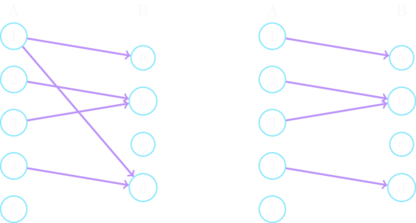
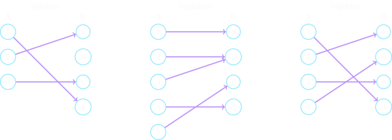

# Abbildungen
Eine der wichtigsten Relationen überhaupt stellen die *Abbildungen* dar.
Sie tauchen überall in der Mathematik auf und in der Realität lassen sich viele Probleme durch diese 
speziellen Relationen darstellen.

## Funktionen
Bevor wir uns den Abbildungen widmen, definieren wir die Eindeutigkeit:

```admonish note title="Eindeutigkeit"
Eine Relation $R \subseteq A \times B$ ist *eindeutig*, wenn
$$
    \forall x \in A\ \forall y, y' \in B:\ (x,y) \in R \wedge (x,y') \in R \rightarrow y = y'
$$
```

Anschaulich gesprochen heißt das, dass von jedem $x$, das in der Relation $R$ vorkommt, nur ein Pfeil weggeht.
Gegeben seien $A = \{1, 2, 3, 4, 5\}$, $B = \{a, b, c, d\}$ und $R = \{(1,a), (1,d), (2,b), (3,b), (4,d)\} \subseteq A \times B$.
$R$ ist nicht eindeutig, da $(1,a)$ und $(1,d)$ vorkommen.
Laut Definition muss aber $y=y'$ gelten, wenn $x$ in $R$ enthalten, aber es gilt $a \ne d$.
Durch Entfernen einer dieser Komponenten, z.B. $(1,d)$ wird $R$ eindeutig.
Im folgenden Schaubild ist links das ursprüngliche $R$ zu sehen, bei dem von der $1$ zwei Pfeile abgehen.
Rechts ist dann die eindeutige Relation, da von der linken Seite maximal ein Pfeil pro Element abgeht.
Bei der Eindeutigkeit ist es egal, wie viele Pfeile rechts auf ein Element zugehen, es geht nur um die linke Seite.



```admonish note title="Abbildung / Funktion"
$f$ ist *Abbildung* oder *Funktion* von $A$ in $B$ $:=$
- $f$ ist Relation, also $f \subseteq A \times B$
- $D(f) = A$, also $f$ ist Relation *__von__ $A$ in $B$*
- $f$ ist eindeutig

Mathematisch-logisch aufgeschrieben:
$$
    \forall x \in A\ \exists ! y \in B:\ (x,y) \in A \times B
$$
```
Man schreibt dafür: $f:\ A \rightarrow B$.  
Statt $R(x) = \{y\}$ wie bei normalen Relationen, schreibt man verkürzt $f(x) = y$, da das $y$ ja nun eindeutig ist.

Eine Funktion ordnet also jedem Element aus $A$ genau ein $y$ aus $B$ zu.

In der Analysis und auch in anderen mathematischen Gebieten findet man häufig eine alternative textliche Einführung:

```admonish note title="Alternative Definition"
Eine Abbildung oder eine Funktion einer Menge $A$ in eine Menge $B$ ordnet jedem Element $x \in A$ genau ein Element $y \in B$ zu.
```

Bei dieser Definition wird komplett auf die mengentheoretische Begriffe wie *geordnetes Paar* oder auch *Relation* verzichtet.
Erst aufbauend darauf wird dann mengentheoretisch der *Graph der Funktion* definiert als $G_f := \{(x,f(x))\ |\ x \in A \wedge f(x) \in B\} \subseteq A \times B$.
Aus mengentheoretischer Sicht stimmen in diesen Fällen die Begriffe "Funktion" und "Graph der Funktion" überein.

#### Beispiele
Gegeben seien $A = \{1, 2, 3, 4, 5\}$ und $B = \{a, b, c, d\}$.
Eine Abbildung $f:\ A \rightarrow B$ können dann sein:
- $f = \{(1,b)\}$
- $f = \{(1,a), (2,b), (3,b), (4,d)\}$
- $f = \{(1,b), (2,c), (3,d), (4,a), (5,b)\}$
- ...

Wenn man eine rechnerische Vorschrift (*Abbildungsvorschrift*) angeben möchte, wie ein $y$ zu einem $x$ berechnet werden soll, 
dann schreibt man Abbildungen so:

```admonish note title="Schreibweisen"
$$
    f:\ A \rightarrow B,\ x \mapsto f(x)
    \qquad\qquad\text{oder}\qquad\qquad
    f: \begin{cases}
        A \rightarrow B\\
        x \mapsto f(x)
    \end{cases}
$$
wobei anstelle $f(x)$ dann z.B. eine *Funktionsgleichung* tritt.
```

#### Beispiele
- $f:\ \mathbb{R} \rightarrow \mathbb{R},\ x \mapsto x^2 \quad$ für eine Parabel
- $f: \begin{cases}
     \mathbb{N} \rightarrow \mathbb{R}\\
     x \mapsto \sqrt{x}
  \end{cases} \quad$ für Wurzeln von natürlichen Zahlen

Es werden noch mehr unterschiedliche Darstellungsformen für Funktionen auftauchen, je nachdem wie es gerade angebracht ist.
Bis dahin sollten einem die Begriffe allerdings so vertraut vorkommen, dass eine genaue Definition oder Einführung nicht notwendig ist.

## Grundlegende Eigenschaften von Funktionen
Die *Verkettung*, oder auch *Komposition*, $f \circ g: A \rightarrow C$ von Funktionen $f:\ A \rightarrow B$ und $g:\ B \rightarrow C$ ist wieder eine Funktion.
Jedoch ist das *Inverse* $f^{-1}$ einer Funktion $f$ im Allgemeinen keine Funktion mehr.

Zwei Funktionen $f$ und $g$ sind gleich $f=g$, wenn für alle $x$ gilt $f(x) = g(x)$.

```admonish note title="Injektivität, Surjektivität, Bijektivität"
Sei $f: A \rightarrow B$ eine Funktion.
- $f$ heißt *injektiv* (*eineindeutig*) $:=\ \forall x,x' \in A:\ f(x) = f(x') \rightarrow x = x'$
- $f$ heißt *surjektiv* (*Abbildung auf $B$*) $:=\ \forall y \in B\ \exists x \in A:\ f(x) = y$
- $f$ heißt *bijektiv* (*eineindeutige Abbildung auf $B$*) $:=\ f$ ist injektiv und surjektiv
```

*Injektivität* bedeutet, dass jedes $y$ aus der Bildmenge *höchstens einmal* abgebildet wird.
Es würden in einem Schaubild also keine zwei oder mehr Pfeile auf ein $y \in B$ treffen.
*Surjektivität* bedeutet, dass die Bildmenge die gesamte Menge $B$ umfasst, dass also $W(f) = B$ gilt. 
Siehe hierzu auch die Definition von [Relationen *auf* einer Menge](1_kartesisches_produkt_relationen#definitions--und-wertebereich).
*Bijektivität* schließlich bedeutet, dass jedes Element $x \in A$ auf *genau ein* Element $y \in B$ abgebildet wird und,
dass jedes $y \in B$ "belegt" ist.



Im Schaubild ist zu erkennen, wie bei der *Injektivität* kein Element aus $B$ mehr als ein mal von einem Pfeil getroffen wird.
Es ist möglich, dass ein Element aus $B$ gar nicht getroffen, aber eben nie mehr als ein mal.
Bei *Surjektivität* ist zu sehen, wie kein Element aus $B$ frei bleibt.
Hier ist es möglich, dass mehr als ein Pfeil auf ein Element aus $B$ geht.
Es muss also mindestens ein Pfeil eingehen.
In dem Schaubild zur *Bijektivität*, als Kombination aus Beidem, ist zu sehen, dass jedes Element von $B$ genau ein mal
von einem Pfeil getroffen wird. 
Es darf also kein Element aus $B$ frei bleiben und es darf nur genau ein Pfeil pro Element eingehen.

Dass dabei $A$ und $B$ gleich viele Elemente haben müssen ist kein Zufall.
Welche Rolle bijektive Abbildungen bei der *Kardinalität* ("Größe") von Mengen haben, wird im Kapitel [Endlichkeit und Kardinalzahlen](../5_endlichkeit.md) erklärt.

#### Beispiele
Gegeben sei $f:\ \mathbb{N} \rightarrow \mathbb{N},\ n \mapsto f(n)$.
Betrachten verschiedene Funktionsgleichungen für $f(n)$:
- $f(n)\ :=\ n+1 \quad$ (*Nachfolgerfunktion*) ist injektiv, aber nicht surjektiv, da $0 \notin W(f)$
- $f(n)\ := \begin{cases} \lfloor \frac{n}{2} \rfloor & n \text{ gerade}\\ 0 & n \text{ ungerade} \end{cases} \quad$ ist surjektiv, 
  aber nicht injektiv, da z.B. $f(1) = f(3) = 0$
- $f(n)\ :=\ n \quad$ (*identische Abbildung*) ist injektiv, surjektiv und damit auch bijektiv

Gegeben sei $f:\ \mathbb{R} \rightarrow \mathbb{R},\ x \mapsto x^2$, also eine Parabelfunktion.
$f$ ist weder injektiv, noch surjektiv.
Wenn man allerdings die Abbildungsmengen einschränkt, kann man eine injektive, surjektive oder bijektive Abbildung erhalten.
Im Folgenden bezeichnen wir $\mathbb{R}^+$ als die Menge der nicht-negativen reellen Zahlen, also reelle Zahlen $\ge 0$.
Am einfachsten ist es, sich die folgenden Fälle zu skizzieren:
- $f:\ \mathbb{R}^+ \rightarrow \mathbb{R},\ x \mapsto x^2 \quad$ ist injektiv, aber nicht surjektiv
- $f:\ \mathbb{R} \rightarrow \mathbb{R}^+,\ x \mapsto x^2 \quad$ ist surjektiv, aber nicht injektiv
- $f:\ \mathbb{R}^+ \rightarrow \mathbb{R}^+,\ x \mapsto x^2 \quad$ ist injektiv und surjektiv und damit auch bijektiv

Zu bijektiven Funktion sagt man auch, sie bilden "*umkehrbar eindeutig*" ab.
Eingangs wurde erwähnt:
> Jedoch ist das *Inverse* $f^{-1}$ einer Funktion $f$ im Allgemeinen keine Funktion mehr.

Im Falle einer bijektiven Abbildung $f$ ist $f^{-1}$ allerdings eine Abbildung und man nennt diese dann *Umkehrabbildung* oder *Umkehrfunktion*.

## Operationen
tbc